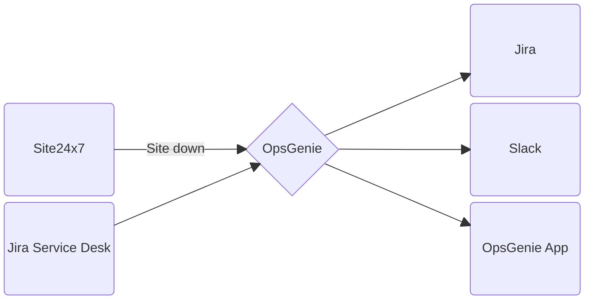

# Our Reference Baseline

Adopting the baseline on a project enhances operational efficiency. It ensures quality, consistency, and clear communication for customers; reduces decision fatigue, boosts productivity, and fosters collaboration for our team; and supports scalability, compliance, and continuous improvement for Axelerant. This comprehensive approach addresses current challenges and prepares us for future growth. [Read more...]()

At this time, this baseline is standardized for our projects in [CDM](https://www.axelerant.com/delivery-engagement-models/continuous-development-and-maintenance) but will eventually also apply to our [managed projects](https://www.axelerant.com/delivery-engagement-models/managed-projects).

## Git Workflow and Health

The exact [Git workflow]() necessarily changes from one project to another. That said, it is possible and we must aim for certain elements of consistency based on our (industry) collective experience. Many of these are defined so because they are obvious to the developer community in general.



* Define a standard name for the trunk. Either `main` or `master` are commonly expected names.
* The default branch on GitHub must be set to the trunk.
* Regularly remove merged branches. It's a good idea to remove it immediately after a PR is merged.
* Avoid long-lived branches (except the trunk). Any exceptions must be [documented](#documentation).
* Close stale PRs and remove the branches. Old code is highly unlikely to be useful for any purpose.
* Remove unused files from the repository.
* Changes are only merged through a pull request.
* Pull Requests contain complete details of the change or points to Jira issues that describes the same.



Read more details [here]().

## Documentation

Documentation is one of the most underrated activities a developer can take up. We remind and encourage the team to keep the documentation current by applying process gates. This may look like a check applied when reviewing a PR, when approving a task, or before marking a task as "done".

Keep in mind the audience for the documentation when writing. The audience could be you, 2 weeks later. It could be another developer on the team learning the system or being onboarded to the project. Keep the documentation readable and get to the point quickly.

Technical documentation _must_ be located in the project repository where it is easy for the developer to refer to it without leaving the IDE. Integration with the [IDP](#idp-integration) allows us to render and read the documentation using a browser. The documentation is generated directly from the project repository and includes both hand-written guides and API documentation using phpDocumentor. By keeping documentation as plain-text Markdown files, we ensure it is easy to maintain, version-controlled, and always reflects the current state of the project

## Code Hosting

To keep things simple, we will always host our projects on [one of our GitHub organizations](https://docs.google.com/document/d/1ncl1a7watXYVekTaPxcEVoaSwoQR091plT19iZDNqKo/edit#heading=h.cte02p7r6r89) that are a part of our [GitHub Enterprise account](https://github.com/axelerant). We get benefits such as advanced access control and 50,000 action minutes per month. Exceptions are possible but we will try to avoid them as much as possible.

## Local Development with DDEV

[DDEV](https://ddev.readthedocs.io/en/stable/) is our tool of choice for setting up local development environments across projects. You need Docker to run it and you can [provide the Docker engine](https://ddev.readthedocs.io/en/stable/users/install/docker-installation/) using the official [Orbstack](https://orbstack.dev/download) (`brew install orbstack`) or [Lima](https://github.com/lima-vm/lima) (`brew install lima`).

Follow the [installation instructions](https://ddev.readthedocs.io/en/stable/users/install/ddev-installation/) to set up DDEV on your machine.

It is very likely that the project you're working on already has DDEV configured. In such cases, you simply have to clone the project and run `ddev start` in the project directory. Follow [these instructions](https://ddev.readthedocs.io/en/stable/users/project/) if the project does not have DDEV configured.


Once DDEV is installed, follow these steps:

1. Clone the project, if not already done.
2. Run `ddev config`. This will ask a series of questions to set up the project. Make sure you use the project name (normalized by removing non-alphanumeric characters) as the site name.
3. Add DDEV addons as relevant. For example, we almost always add the [ddev-redis](https://github.com/ddev/ddev-redis) addon.
4. Adjust the `.ddev/config.yaml` file to set the correct PHP version, database images, etc. As a rule, try to match the versions to something as close to production as possible. This is not always exactly possible as DDEV will only maintain commonly supported versions. For example, DDEV does not support MariaDB 11.0 because it is not LTS. In this case, use MariaDB 10.11.
5. Run `ddev start` to spin up the local environment and verify if everything is working correctly.
6. Commit the files in the `.ddev` directory and other generated files such as `settings.ddev.php` and create a PR.



## Application Cache

With CMSes like Drupal, we always use an application cache like [Redis](https://redis.io/) or [Memcached](https://memcached.org/). With Drupal's built-in dynamic caching abilities, there is no reason to not use an external cache. Given the size of our typical project, the slight increase in complexity is worth it.

We default to Redis unless there is a good reason to use Memcached. Often the reason is that the hosting provider may only support Memcached. Given the [recent Redis announcement](https://redis.io/blog/redis-adopts-dual-source-available-licensing/), we may change this recommendation based on the hosting landscape and performance considerations.



Once DDEV is configured for a project, follow these steps:

1. Run `ddev get ddev/ddev-redis` (for Redis 7, run use `ddev/ddev-redis-7`).
2. Run `ddev restart`.
3. These add-ons will typically add a `settings.ddev.redis.php`. Verify it exists.
4. Update `settings.php` to configure Redis for the hosting provider. You can copy the settings from `setting.ddev.redis.php` and update the values to use the hosting provider's mechanism to set Redis.
5. Commit the files in the `.ddev` directory and the settings files mentioned above. Push the changes.



Once DDEV is set up for a project, follow these steps:

1. Run `ddev get ddev/ddev-memcached` to install Memcached support.
2. Apply the steps [here](https://git.drupalcode.org/project/memcache/-/blob/8.x-2.x/README.txt) to create the settings.
3. Add the [Memcache API and Integration](https://www.drupal.org/project/memcache) module to your project.
4. Commit the changes in the `.ddev` directory and the updated settings files.



## Database

The default database we pick is [MariaDB](https://mariadb.org/). Like with the application cache, we may switch to [MySQL](https://www.mysql.com/) depending on the hosting provider. In all cases, we try to match the versions on the production instance as closely as possible.

As of this writing, the LTS version for [MariaDB](https://endoflife.date/mariadb) is 10.11 and for [MySQL](https://endoflife.date/mysql) is 8.0. Try to pick this version for both local development and production unless there is a specific need. Both Drupal 10 and 11 can use these versions.


Once DDEV is configured, use one of these commands to set the database version:

* For MariaDB 10.11, run `ddev config --database=mariadb:10.11`.
* For MySQL 8.0, run `ddev config --database=mysql:8.0`.
* Change the version numbers if required.



On some hosts, you also have to set the transaction isolation level. Follow the [instructions here](https://www.drupal.org/docs/getting-started/system-requirements/setting-the-mysql-transaction-isolation-level).

## File Storage for user content

Drupal supports public and private file schemes to store user-uploaded content. The public file scheme is the default mechanism and is suitable unless there is a specific requirement. Both of these schemes are stored in the local filesystem (e.g., public files are saved in `sites/default/files`). Hosts that support Drupal provide a mechanism to make these locations writable.

In the future, we will provide infrastructure support to keep these files on an object store such as S3 by default. For now, use modules like [`stage_file_proxy`](https://www.drupal.org/project/stage_file_proxy) to access these files in development environments.

## Local checks

We run local checks on our changes before committing our changes. For Drupal projects, we have a convenient wrapper called [`drupal-quality-checker`](https://github.com/axelerant/drupal-quality-checker) that uses GrumPHP to run various checks on commits. Installation is a question of installing the composer package and copying the configuration files.

### Code Quality checks

We use tools such as `PHPCS`, `PHPStan`, `eslint`, `stylelint`, and others depending on the language. It is always a good idea to run these tools before making a commit and we do that automatically through tools such as `drupal-quality-checker` and `husky`. Include such tools in your project at all times and have them run on git commits. Additionally, these tools must also run in CI jobs.

## Debugging

Step debuggers are extremely important tools to have ready during development. For PHP, the debugger of choice is XDebug. There is an excellent integration available with [DDEV](#local-development-with-ddev) and IDE configuration is not very complex. [Documentation for XDebug with DDEV](https://ddev.readthedocs.io/en/stable/users/debugging-profiling/step-debugging/) has all the setup instructions to enable XDebug and configure IDEs to listen to it.

## IDP Integration

[Axelerant IDP](https://idp.axelerant.com/) is the portal to view all technical information relevant to a project. Our IDP is built with Backstage and we add projects to the IDP using a `catalog-info.yaml` file. This file defines some of the attributes such as the name, Jira project ID, team, and IDs for external tools like NewRelic and Sentry.


Here is an [example file](https://github.com/contrib-tracker/backend/blob/main/catalog-info.yaml) from contrib-tracker.

```yaml
apiVersion: backstage.io/v1alpha1
kind: Component
metadata:
  name: contrib-tracker
  description: Axelerant Contribution Tracker
  title: Contrib Tracker
  annotations:
    github.com/project-slug: contrib-tracker/backend
    sentry.io/project-slug: contrib-tracker
    newrelic.com/dashboard-guid: <GUID>
    jira/project-key: CONT
    backstage.io/techdocs-ref: dir:.
spec:
  type: website
  owner: platform_engineering
  lifecycle: production
  system: public website
```



Once you add this file to the default branch in your repository, manually import the project using the "[Register an existing component](https://idp.axelerant.com/catalog-import)" button in the IDP.

## Continuous Integration (CI)

Our CI tool of choice is GitHub Actions. We rely on automation to run repeated tasks reliably and as we use GitHub for [hosting our code](#code-hosting), it is a simple decision to use GitHub Actions we have included as part of our Enterprise subscription.

A typical CI pipeline begins with linting and code-style checks. This is followed by tests arranged in the order of quickest tests first followed by longer ones (this is so that we get quick feedback in case of a failure). Finally, the pipeline deploys to a feature branch or a present environment for manual verification.

Since a CI pipeline is considerably more complex, an example describes the process best. Our go-to example is [the pipeline of Contrib Tracker](https://github.com/contrib-tracker/backend/blob/main/.github/workflows/ci.yml). Use that as your base and change the specifics as required.

## Updates Tracking

As we are on GitHub, we use Dependabot for tracking updates. We typically track updates for all the dependencies we use (typically PHP, JavaScript, and GitHub Actions itself). We schedule alerts on a weekly basis unless there is a specific need. We also [group](https://docs.github.com/en/code-security/dependabot/dependabot-version-updates/configuration-options-for-the-dependabot.yml-file#groups) related dependencies so that we are not flooded by pull requests and associated CI runs.

As before, use the contrib tracker project as an example of [a Dependabot configuration file](https://github.com/contrib-tracker/backend/blob/main/.github/dependabot.yml) and change it to suit your needs.

## Logging

We can't fix what we can't see. Logging is the most fundamental aspect of observability in how our applications run so that we fix a problem, even proactively. For this, we rely on something more sophisticated than simply logging into the database or syslog. Our tool of choice for this purpose is [Sentry](https://axelerant.sentry.io/).

Any application that you build must be configured to write logs to Sentry. This is fairly straightforward as Sentry has SDKs in a number of languages and frameworks. For Drupal, use the [Raven](https://www.drupal.org/project/raven) module to pull in the integration and also configure what should be logged.

Read more details [here]().

## Functional Testing

We automate our tests using [Cypress](https://www.cypress.io/). We focus more on functional testing rather than unit testing because this is more of a fit for a typical project at Axelerant. Unit testing has its place and we should write unit tests but we recognize that writing tests introduces a cognitive load. To limit the number of paradigms that people have to deal with, we are limiting ourselves to the most impactful kind of tests and that is a functional test run in a browser-like environment.

We maintain a set of [template test scripts](https://github.com/contrib-tracker/backend/tree/main/web/themes/custom/contribtracker/cypress/e2e) to accelerate the setup and implementation of functional tests across projects. These scripts are tagged based on various scenarios to select which tests to run depending on the scenario. Tagging ensures an efficient testing process by focusing on relevant scripts during development and continuous integration. These tests must run via CI but should also be run locally before pushing the changes. A CI run example may be found in [the contrib-tracker example pipeline](https://github.com/contrib-tracker/backend/blob/main/.github/workflows/ci.yml).

## Reverse Proxy

A [reverse proxy]() is highly recommended for most of the sites that we build. [Varnish](https://varnish-cache.org/) is a popular option for use with Drupal and it is supported out of the box with most of the PaaS providers we use.

Varnish is a separate application from Drupal's server stack. You do not _need_ any module or customization on Drupal as long as the cache headers are correct. In practice, it is useful to install a module such as [Purge](https://www.drupal.org/project/purge) to invalidate the cache when required.




### General Architecture

Varnish usually sits in front of your web server and can directly serve traffic from the Internet. It will listen to requests and if not already cached, it can talk to a web server to retrieve the content and, depending on the cache headers, cache it. This means that Varnish may be installed on a completely different machine than the web server.





### DDEV installation

If Varnish is used in production, it is a good idea to keep it enabled during development as well. This helps us test issues that may crop up during development. For DDEV, use the [Varnish addon for DDEV](https://github.com/ddev/ddev-varnish) to install Varnish in your Drupal project.

```bash
ddev get ddev/ddev-varnish
ddev restart
```

The addon creates new URLs that may be used during development to skip Varnish. If your Drupal URL is `contrib.ddev.site`, then this addon will also add `novarnish.contrib.ddev.site`. You can use the latter to bypass Varnish during development.



### Drupal integration using modules

As mentioned before, a module is not strictly necessary to use Varnish. But it is often necessary to invalidate cache entries according to Drupal's rules.

1. Install the Advanced Varnish Module. `ddev composer require drupal/adv_varnish`.
2. Enable the Advanced Varnish Module. `ddev drush en -y adv_varnish`.
3. Configure it by following the documentation: [Advanced Varnish Module Documentation](https://www.drupal.org/docs/contributed-modules/advanced-varnish).
4. Set up the VCL config to work with Drupal tags. Please copy content from [default.vcl](https://github.com/axelerant/backstage-idp/blob/main/axelerant/software-templates/baseline-varnish-integration/skeleton/default.vcl) to `.ddev/varnish/default.vcl`. See this [documentation page](https://www.drupal.org/docs/drupal-apis/cache-api/cache-tags-varnish) for more details.
5. Restart DDEV. `ddev restart`

### Host Specific Configurations

#### 1. Acquia

* Install the Acquia Purge Module. `ddev composer require drupal/acquia_purge`.
* Enable the Acquia Purge Module. `ddev drush en -y acquia_purge`.
* Configure it by following the documentation: [Acquia Purge Installation Instruction](https://git.drupalcode.org/project/acquia_purge/raw/HEAD/INSTALL.md).
* Disable `adv_varnish` in the production `settings.php` file, as it is only used for local cache invalidation. In production, the `acquia_purge` module will handle the task.

  ```php
  // Disable Varnish
  $config['adv_varnish.cache_settings']['general']['varnish_purger'] = FALSE;
  $config['adv_varnish.cache_settings']['available']['enable_cache'] = FALSE;
  ```

#### 2. Platform.sh

* Please refer to the [Platform.sh Varnish Documentation](https://docs.platform.sh/add-services/varnish.html) for detailed instructions on setting up the Varnish service in your project.

#### 3. Pantheon

* Install the Pantheon Advanced Page Cache Module. `ddev composer require drupal/pantheon_advanced_page_cache`.
* Enable the Acquia Purge Module. `ddev drush en -y pantheon_advanced_page_cache`.
* Disable `adv_varnish` in the production `settings.php` file, as it is only used for local cache invalidation. In production, the `pantheon_advanced_page_cache` module will handle the task.

  ```php
  // Disable Varnish
  $config['adv_varnish.cache_settings']['general']['varnish_purger'] = FALSE;
  $config['adv_varnish.cache_settings']['available']['enable_cache'] = FALSE;
  ```




## Backup and Recovery Plan

Use the backup capabilities of the PaaS provider where the websites are hosted. PaaS providers provide mechanisms to set the backup frequency and retention. Here is a list of some of the common ones that we use.

* [Acquia Cloud](https://docs.acquia.com/acquia-cloud-platform/manage-apps/back-up)
* [Acquia Site Factory](https://docs.acquia.com/site-factory/manage/website/backup)
* [Pantheon](https://docs.pantheon.io/guides/backups)
* [Platform.sh](https://docs.platform.sh/environments/backup.html)

## Incident Reporting

We use [OpsGenie](https://axelerant.app.opsgenie.com/) for incident reporting and it is integrated with our other tools such as Jira and Slack. We use [Site 24x7](https://www.site24x7.com/website-monitoring.html?src=Productbox&pg=home) to monitor the websites that we support and create alerts in OpsGenie through its integration.



Each website that we maintain must be configured on Site24x7 for monitoring. This sends alerts to OpsGenie which, in turn, sends notifications as per our team structures. For teams to be able to respond to alerts, there must be a runbook with all the information required to understand the alert and resolve the situation.

## Infrastructure (non-prod)

To streamline our development and deployment processes, we use [Platform.sh](https://platform.sh/) as the platform for our non-production environments. We try to match the stack as closely as possible with the production environment. This means that we replicate all parts of the stack–components like varnish, redis, and SOLR. We also try to match the version as closely as possible.

To configure your project to run on platform.sh, you need at least these three files.

* [`.platform.app.yaml`](https://github.com/platformsh-templates/drupal10/blob/master/.platform.app.yaml)
* [`.platform/routes.yaml`](https://github.com/platformsh-templates/drupal10/blob/master/.platform/routes.yaml)
* [`.platform/services.yaml`](https://github.com/platformsh-templates/drupal10/blob/master/.platform/services.yaml)

The links below point to sample configuration for a Drupal 10 website. Here are a few more templates you can evaluate

* [Drupal 10](https://github.com/platformsh-templates/drupal10)
* [Drupal 9](https://github.com/platformsh-templates/drupal9)
* [WordPress](https://github.com/platformsh-templates/wordpress-composer)
* [Laravel](https://github.com/platformsh-templates/laravel)
* [Decoupled Drupal](https://github.com/platformsh-templates/nextjs-drupal)

## Secret Management

We use various platforms to securely store and access our secrets. Of them, 1Password is our canonical source for all types of secrets that we need on a project. This includes account logins, [SSH keys](https://developer.1password.com/docs/ssh/), [API keys and tokens](https://developer.1password.com/docs/cli/shell-plugins/), credentials, and other sensitive information that would be used by the team or by the system during build or runtime.

Additional places where secrets may be stored are:

* Repository secrets on GitHub.
* Any mechanism to store sensitive information on various PaaS we use.

## Access control for team members

All the platforms that we use to collaborate on code and projects provide some sort of access control. Apply the principle of least privilege required when assigning permissions. Specifically on GitHub, teams must be used to grant access to a repository or multiple repositories. Using teams helps us manage access control in a single place and gives a suitable level of access to any number of repositories. Typically, multiple teams should be created for team leads and other engineers so that the team consisting of team leads can get elevated rights on the repository.

## Deployment (prod)

When continuous deployment is not possible, tagged deployment is preferred when deploying a release to the production. Since there is usually only a single version of a website in production, a simple branched workflow with a single trunk branch (often called `main` or `master`) is sufficient. This branch can be continuously deployed to a staging environment for internal or user testing. Once a test run is complete, that commit is tagged and deployed to the production instance.


In the above, the `main` branch represents the staging environment and the tags of `v20240503` and `v20240517` are the tags deployed to production. As you might have deduced, the version numbers are dates in `vYYYYMMDD` format. Any version format may be used as long as this is well-defined and understood within the team. For websites, versions of this format make it easy to create tags and figure out what a tag means without worrying about semantic versioning.

## Search Engine

Common search engines used with Drupal are SOLR and Elastic Search. We typically always prefer SOLR because of the available ecosystem within Drupal, hosting support, and tools. But Elastic Search and other proprietary options such as Algolia or open-source ones like Meilisearch. When the search index is externally hosted, we don't have to worry about setting it up for local development or in other infrastructure. For self-hosted options, there are ways to configure local environments to run the search indexer.

For SOLR, keep in mind that there are multiple DDEV recipes and you should use the one that matches your production instance. For example, Acquia Search is currently Solr 7 (planned upgrade to 8). In this case, you should use

* [ddev-solr](https://github.com/ddev/ddev-solr) _(recommended)_. It installs SolrCloud with Solr 9.
* [ddev-drupal-solr](https://github.com/ddev/ddev-drupal-solr). It installs Solr 8 and does not work with earlier versions.
* [ddev-contrib](https://github.com/ddev/ddev-contrib). This includes support for many versions of Solr and you can match with your production instance. As mentioned before, use [Solr 7](https://github.com/ddev/ddev-contrib/tree/master/docker-compose-services/solr-7) for Acquia Search.
