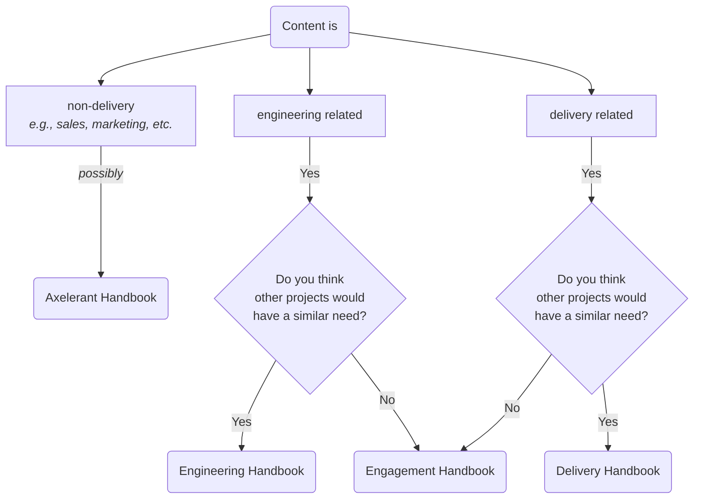

# Contributing to the Handbook

This handbook is not set in stone. We make mistakes, learn better methods, and update our practices. Our handbook should reflect that. This cannot happen without your help.

## How to decide where to place content

It is probably easier to define what content DOES NOT fit in the Axelerant Engineering Handbook. This is a list of categories or traits in content that make it unfit for the handbook. It is important to note that some amount of judicial application must be made in following these rules. To understand how to apply judgment, read the sections on the target audience and the intent of the handbook.

- Project-specific details.

- Operational routines and activities such as details of time logs, leave policies, project-specific communication, norms, etc.

- Technologies that are used on very few projects and not likely to be used often.
  Techniques and practices which are specific to just one customer and are not likely to be generalizable.

- Any details, technical or otherwise, that are easily found elsewhere. That is to say, that even for technical topics, the handbook is just meant to provide brief descriptions, references, and links to detailed documentation elsewhere.

- Any details of software engineering practices that are executed by the management. While there is a strong role of management in delivering software, that is not the intent of the engineering handbook.

### Flowchart

We currently have the below handbooks at Axelerant.

1. **Axelerant Handbook** applicable to everyone at Axelerant.

2. **Engineering Handbook** applicable to engineers at Axelerant.

3. **Delivery Handbook** (residing in the Delivery section of Axelerant Handbook) applicable to one or more Program(s) and projects and talks about how we deliver at Axelerant.

4. **Engagement Handbook** specific to the project.




Ask the following questions to yourself whenever you find that you are unsure whether the content you have needs to go into which handbook.

1. Is the content applicable for engineers alone (check the Engineering Handbook for what kind of content we already have)?

   - If the answer to the above question is yes, do you think that other projects would have a similar use case for engineers in the future?

     i. If the answer to the above is no, your Engagement Handbook would be the place where the content needs to go.

     ii. If yes, this content might need to go into the Engineering Handbook. Raise a PR against the Engineering Handbook and inform the Platform Team.

2. Is the content applicable to everyone in a project and related to how we deliver things?

   - If the answer to the above question is yes, do you think that other projects would have a similar use case in the future?

     i. If the answer to the above is no, your Engagement Handbook would be the place where the content needs to go.

     ii. If yes, this content might need to go into the Delivery Handbook. Discuss with the WSM team, they can guide you further.

3. Is the content applicable for everyone in a project however not related to delivery but involves other departments like Sales, Marketing, etc…?
   - If the answer to the above question is yes, this might be a potential candidate for Axelerant Handbook. Kindly check with the respective department head who can guide you further.



### Need for judicial application

It is important to reiterate that the decision will involve discrete judgment and possibly, discussion. Use the above points and the flowchart as a reference, but in the end, apply your judgment. We are flexible in changing our stance wherever it makes sense. Create an issue, open a PR, or just send a message on Slack to talk about your content and where it can go in the engineering handbook.

## Markdown: Our Choice for Documentation

The Engineering Handbook uses [Markdown](https://www.markdownguide.org/basic-syntax/) primarily due to its target audience: engineers. Markdown, a developer-friendly format, simplifies the editing process and integrates seamlessly with version control systems like Git. Currently, the handbook is hosted on GitHub as a public repository, reflecting our commitment to openness and engineering proficiency. This decision has two implications: pragmatically, it’s easier for developers to work with, and aspirationally, it encourages engineers to regularly interact with command-line and coding-related tools outside their projects, reinforcing our engineering-focused culture.

When contributing to the Engineering Handbook using Markdown, it’s important to be mindful of special texts that may be responsible for formatting or creating dynamic content. For instance, you might come across a section at the top enclosed between `---` lines. This is known as the “front matter”, and it’s where you can set predefined page variables. There are also shortcodes that are used to create dynamic content within your Markdown files. They are specific to the system you’re using and are typically enclosed in double curly braces `{{ }}`. For example, **\{\{< section-pages >\}\}** is a shortcode that dynamically generates a list of all pages in the current section.

## Common Issues

This is a list of known issues and gotchas to keep in mind when working with Markdown here.

### Using links in headers (with or without relref)

In some circumstances, using links in headers will result in various problems. This happens when any of the parent pages tries to generate a table of contents in some way (e.g., by using the `<section-pages>` shortcode).

- When not using `relref`, it will simply result in a broken link in the generated table of contents. Instead of the link to the section, it will render the link to the one specified in the heading.
- When using `relref`, it enters an infinite loop and sometimes breaks with an error like this:

  ```log
  panic: unknown shortcode token "(temporary token)" (number of tokens: 1)

  goroutine 10462 [running]:
  github.com/gohugoio/hugo/hugolib.(*cachedContent).contentRendered.func1.3({0x103ded2a0, 0x14001928930}, {0x14002f8cb20, 0x1a})
          github.com/gohugoio/hugo/hugolib/page__content.go:553 +0x17c
  github.com/gohugoio/hugo/hugolib.expandShortcodeTokens({0x103ded2a0, 0x14001928930}, {0x14000d9e800, 0x70d, 0x800}, 0x14001cd5c18)
  ```

FWIW, using the actual temporary token in the markdown will also throw this error. The temporary token is `HAHA HUGO SHORTCODE some_number HBHB` (without spaces).

#### Solution

There are two options. Pick any of these:

1. Don't use `<section-pages>` in any of the parent pages (`_index.md` in the same directory or above).
2. Don't place links in headers level 2 and below. Links in a level 1 header does not run through `<section-pages>` and does not cause problems.
